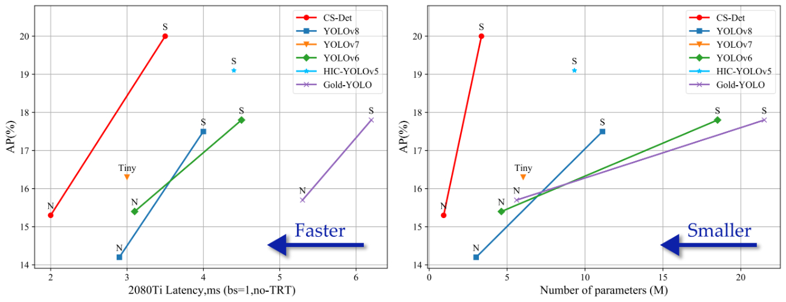

# CS-Det: Cross-Scale Detector for Drones


## Abstract

In the rapidly developing field of drones, real-time object detection is crucial for enhancing their intelligence. However, existing research always prioritizes complex networks to boost performance, neglecting the computational power constraints of drones. This paper introduces cross-scale detector(CS-Det), an ultra-lightweight detector tailored for drones that comprehensively innovates upon existing lightweight detectors. Firstly, we propose a cross-scale mechanism(CSM) to guide the detector’s architecture design, ensuring compatibility of the head, neck, and backbone through a top-down approach. Secondly, an inverted expand partial residual(IEPR) is introduced at the basic block level. This module utilizes depth re-parameterization and grouping strategies to improve feature extraction efficiency. Finally, a training strategy, namely decay data augmentation(DDA), is developed to enhance the detector’s generalization capability. This strategy leverages the diverse representations from strong data augmentation techniques. Experimental results demonstrate that CS-Det achieves state-of-the-art balance between detection performance, inference speed, and parameter efficiency.




## Code

The repo is the official implementation of CS-Det.

Our config file is at [ultralytics/cfg/models/CS-Det](ultralytics/cfg/models/CS-Det)

Our IEPR module is at [ultralytics/nn/modules/csdet_block.py](ultralytics/nn/modules/csdet_block.py)


## Requirement

a. Install [torch 2.0.1 and torchvision 0.15.2](https://pytorch.org/)

```shell
pip install torch==2.0.1 torchvision==0.15.2 --index-url https://download.pytorch.org/whl/cu118
```

b. Install other requirements

```shell
pip install -e .
```


## Usage

### Data preparation

You could download dataset form [VisDrone(YOLO Format)](https://pan.baidu.com/s/1xWKSZrib3FEBM8R9yY-2Rw?pwd=ry6x ) and [UAVDT dataset (YOLO Format)](https://pan.baidu.com/s/14PREuNKf0gVQFjdKUJV-TA?pwd=sf4x) .

### Training

#### 1. VisDrone2019

```shell
% CS-Det-N
yolo detect train data=VisDrone.yaml model=CS-Det-N.yaml device=0,1,2,3 optimizer=SGD lr0=0.02 epochs=300 batch=32 name=your-work-dir decay_aug=True mosaic=1.0 copy_paste=1.0 mixup=1.0 close_mixup=225 close_mosaic=150 close_copy_paste=75 > train.log 2>&1 &

% CS-Det-S
yolo detect train data=VisDrone.yaml model=CS-Det-S.yaml device=0,1,2,3 optimizer=SGD lr0=0.02 epochs=300 batch=32 name=your-work-dir decay_aug=True mosaic=1.0 copy_paste=1.0 mixup=1.0 close_mixup=225 close_mosaic=150 close_copy_paste=75 > train.log 2>&1 &
```

More super parameters about training please refer to  [Ultralytics YOLOv8 Docs](https://docs.ultralytics.com/).

#### 2. UAVDT

```shell
% CS-Det-N
yolo detect train data=UAVDT.yaml model=CS-Det-N.yaml device=0,1,2,3 optimizer=SGD lr0=0.01 epochs=300 batch=32 name=your-work-dir decay_aug=True mosaic=1.0 copy_paste=1.0 mixup=1.0 close_mixup=225 close_mosaic=150 close_copy_paste=75 > train.log 2>&1 & 

% CS-Det-S
yolo detect train data=UAVDT.yaml model=CS-Det-S.yaml device=0,1,2,3 optimizer=SGD lr0=0.02 epochs=300 batch=32 name=your-work-dir decay_aug=True mosaic=1.0 copy_paste=1.0 mixup=1.0 close_mixup=225 close_mosaic=150 close_copy_paste=75 > train.log 2>&1 & 
```

### Evaluation

```shell
yolo detect val data==/path/to/data.yaml model=/path/to/your/best.pt testspeed=False save_json=True name=your-work-dir > val.log 2>&1 &
```

